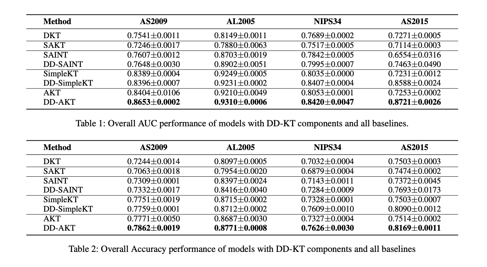

# Denoising Diffusion Knowledge Tracing (DD-KT)
This repository contains the source code and reproducibility materials for **"Denoising Diffusion Knowledge Tracing"**.

<!--

-->

DD-KT is a novel framework that combines diffusion modeling with a transformer-based backbone to enhance the robustness and interpretability of knowledge tracing. It introduces:
- A **Denoising-Aware Attention Mask (DAM)** that dynamically suppresses anomalous student interactions.
- A **Low-Coupling Diffusion Transformer (LC-DiT)** that applies diffusion only during training to improve representation without affecting inference efficiency.

## Installation
The following commands are used to set up the environment for DD-KT:

Create a conda environment:

```bash
conda create --name=ddkt python=3.7.5
conda activate ddkt
```

```bash
pip install -U pykt-toolkit -i https://pypi.python.org/simple
```

## Dataset
ASSISTments2009(AS2009) 
(https://sites.google.com/site/assistmentsdata/home/2009-2010-assistment-data/skill-builder-data-2009-2010)
Algebra2005(AL2005) 
(https://pslcdatashop.web.cmu.edu/KDDCup/)
NIPS34 
(https://eedi.com/projects/neurips-education-challenge)
ASSISTments2015(AS2015) 
(https://sites.google.com/site/assistmentsdata/datasets/2015-assistments-skill-builder-data)
### Data Preparation
```bash
cd train
python data_preprocess.py --dataset_name=assist2015
```

## Run DD-KT model
You can train the DD-KT models using the following commands. Hyperparameters can be customized.

For DD-SAINT:
```bash
CUDA_VISIBLE_DEVICES=0 python wandb_ddsaint_train.py --dataset_name=assist2015 --fold=0 --emb_type=qid ---seed=3407 --dropout=0.2 --emb_size=256 --learning_rate=1e-3 --num_attn_heads=8 --n_blocks=4 --lamb=1e-4 --tau=1 --hard=True --delta=1e-3 --timesteps=500 --beta_start=0.0001 --beta_end=0.02 --diffusion_w=0.3 --beta_sche=exp
```

For DD-AKT:
```bash
CUDA_VISIBLE_DEVICES=0 python wandb_ddsaint_train.py --dataset_name=assist2015 --fold=0 --emb_type=qid ---seed=3407 --dropout=0.2 --d_model=256 --d_ff=512 --num_attn_heads=8 --n_blocks=4 --learning_rate=1e-4 --lamb=1e-4 --tau=1 --hard=True --delta=1e-3 --timesteps=500 --beta_start=0.0001 --beta_end=0.02 --diffusion_w=0.3 --beta_sche=exp
```

For DD-SimpleKT:
```bash
CUDA_VISIBLE_DEVICES=0 python wandb_ddsaint_train.py --dataset_name=assist2015 --fold=0 --emb_type=qid ---seed=3407 --dropout=0.1 -final_fc_dim=512 --final_fc_dim2=256 --num_layers=2 --nheads=4 --loss1=0.5 --loss2=0.5 --loss3=0.5 --start=50 --d_model=256 --d_ff=64 --num_attn_heads=4 --n_blocks=4 --learning_rate=1e-4 --lamb=1e-4 --tau=1 --hard=True --delta=1e-3 --timesteps=500 --beta_start=0.0001 --beta_end=0.02 --diffusion_w=0.3 --beta_sche=exp
```

## Run Baseline Model

The following command runs a baseline AKT model:
```bash
CUDA_VISIBLE_DEVICES=0 python wandb_akt_train.py --use_wandb=0 --add_uuid=0 --fold=0 --emb_type=qid --d_ff=64 --dropout=0.1 --d_model=256 --num_attn_heads=4 --seed=42 --n_blocks=4 --learning_rate=0.0001 --dataset_name=assist2015
```
Hyper Parameter of each baseline can be found at[https://github.com/pykt-team/pykt-toolkit]

## Evaluate Your Model
After Model Training process, evaluate predictive performance via following command:
```bash
python wandb_predict.py --save_dir=saved_model/YourModelPath
```
Note: --save_dir is the save path of your trained model that you can find in your training log

## Final Results
<!--

-->